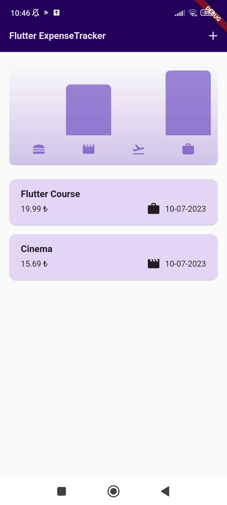
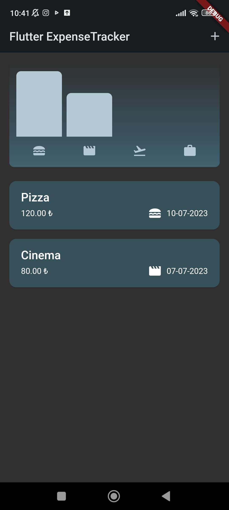
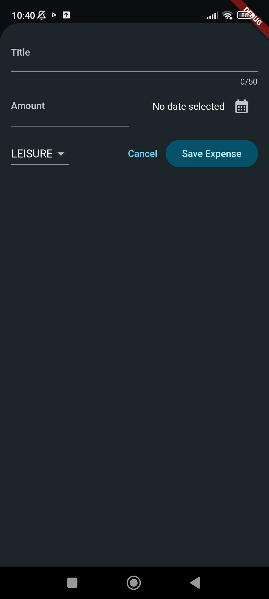
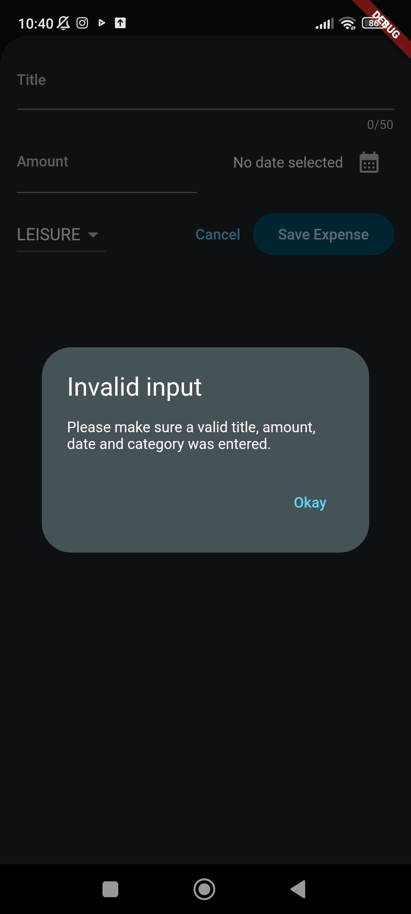

<h1 align="center">Expense Tracker App</h1>
<p align="center">  
The expense tracker app allows users to register their expenses. Users can see their expenses both in a list and in a chart.
  </p>

## Screenshots
<table>
    <tr>
    <td>Home</td>
    <td>Dark Theme</td>
    <td>Adding Expense</td>
    <td>Error Message</td>
   </tr> 
  <tr>
 <td></td>
 <td></td>
 <td></td>
 <td></td>
   </tr>  
  </tr>
</table>

## Installation

1. Create a new Flutter project:
  ```shell
  flutter create expense_tracker_app
  ```

2. Clone the repository:
  ```shell
  git clone https://github.com/GunseliUnsal/expense_tracker_app.git
  ```

3. Test your changes by running the app on an emulator or a physical device:
  ```shell
  flutter run
  ```


## Packages

- [uuid](https://pub.dev/packages/uuid) - Flutter UUID package generates unique identifiers (UUIDs) for Flutter applications.
- [intl](https://pub.dev/packages/intl) - Flutter intl package provides localization and internationalization support for Flutter applications.
